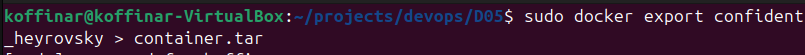
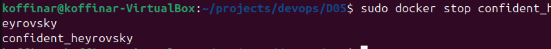
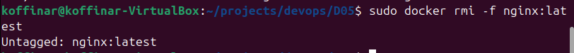
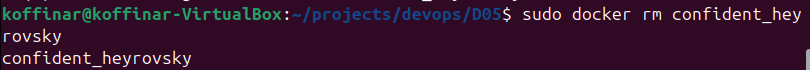
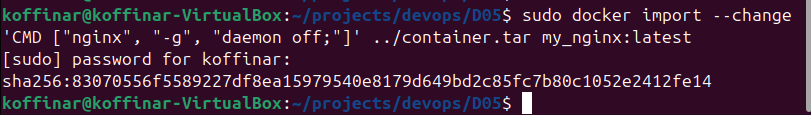
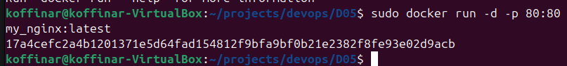
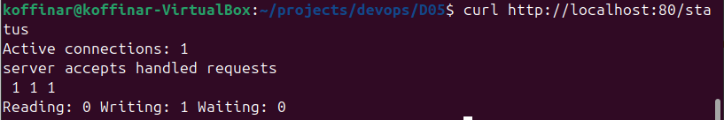

## Part 2
-   read nginx.conf into container from exec.


- create nginx.conf.


- configure /status link


- cp into container 


- resolve conflict 


- reload container


- check out /status Path


- export 


- stop 


- remove image 


- remove container 


- import 


- ```docker import теряет команду запуска (CMD/ENTRYPOINT), которая была в оригинальном образе nginx```
- run 


- check out /status
