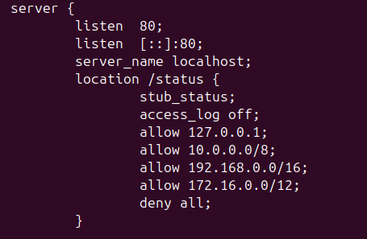
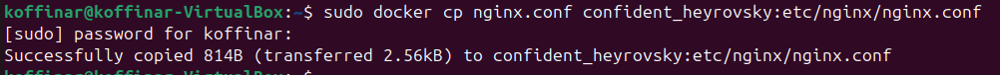
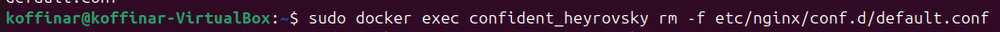
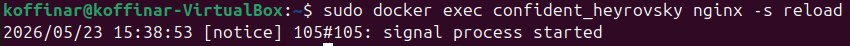
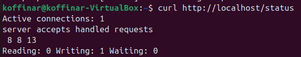

## Part 2
-   read nginx.conf into container from exec.

- create nginx.conf.

- configure /status link

- cp into container 

- resolve conflict 

- reload container

- check out /status Path

